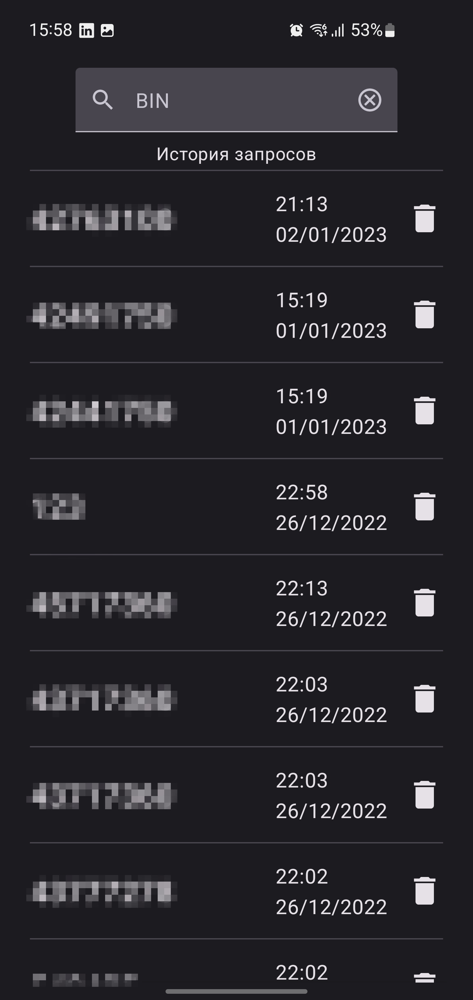
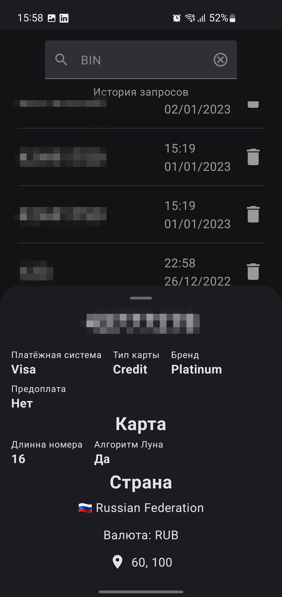

# CFT BinList

Задание на курс ШИФТ от компании ЦФТ. Приложение для получения информации о банковской карте по её BIN номеру с сервиса binlist. На главном экране отображается история запросов, хранящаяся в локальной базе данных(использовал Room), а также поле для ввода номера карты, после ввода открывается BottomSheetDialog с информацией о карте. Архитектура MVVM, DI - Hilt, работа с API - c помощью Retrofit и Coroutines, с базой данных - Room и Coroutines. UI реализован на Jetpack Compose.

## Стек
 - Kotlin
 - MVVM
 - Clean Architecture
 - Hilt
 - Jetpack Compose
 - Kotlin StateFlow
 - Room
 - OkHttp3
 - Retrofit2
## Скриншоты

